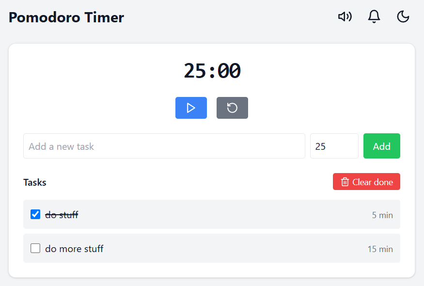

# Pomodoro Timer Web App
==========================

A simple and effective Pomodoro Timer web app that helps you stay focused and boost your productivity.

## Features

* **Pomodoro Timer**: Work in focused 25-minute increments, with 5-minute breaks in between.
* **Add Tasks**: Create and manage your tasks, and associate them with specific Pomodoro sessions.
* **Local Storage**: Your tasks and settings are stored locally in your browser, so you can access them even when offline.
* **Sound Signal**: A gentle sound signal alerts you when your Pomodoro session is complete.

## Screenshots

## Live App

Try out the app live at: [https://valiantsin2021.github.io/pomodoro](https://valiantsin2021.github.io/pomodoro)

## How to Use

1. Set your Pomodoro timer by clicking the "Start" button.
2. Add tasks by clicking the "Add Task" button and typing in the task description.
3. Take breaks and stay focused with the sound signal alerting you when your session is complete.

## Technologies Used

* HTML5
* CSS3
* JavaScript (ES6+)
* LocalStorage API

## Contributing

Pull requests and issues are welcome! If you'd like to contribute to the project, please fork the repository and submit a pull request with your changes.

## License

This project is licensed under the MIT License. See the LICENSE file for details.